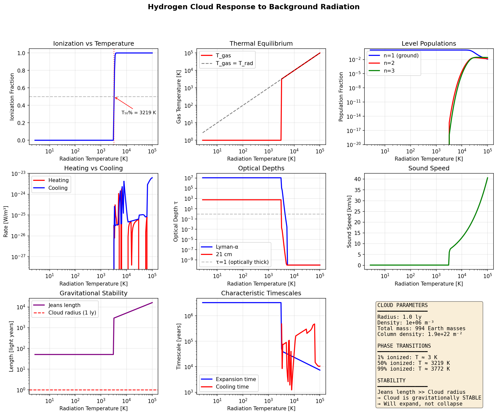
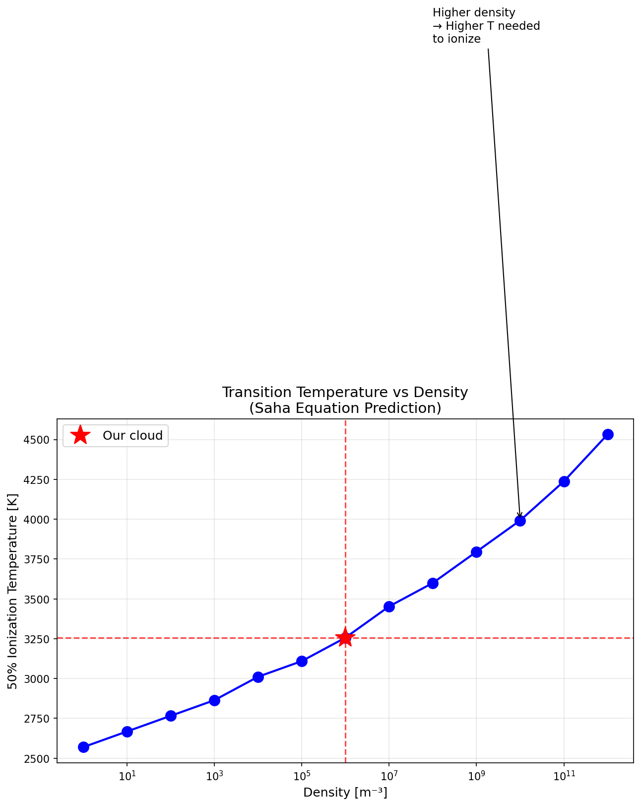
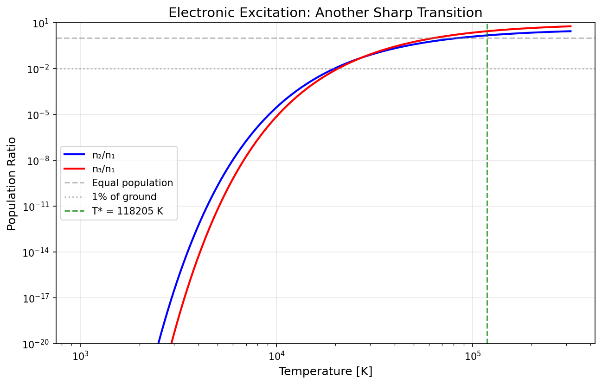
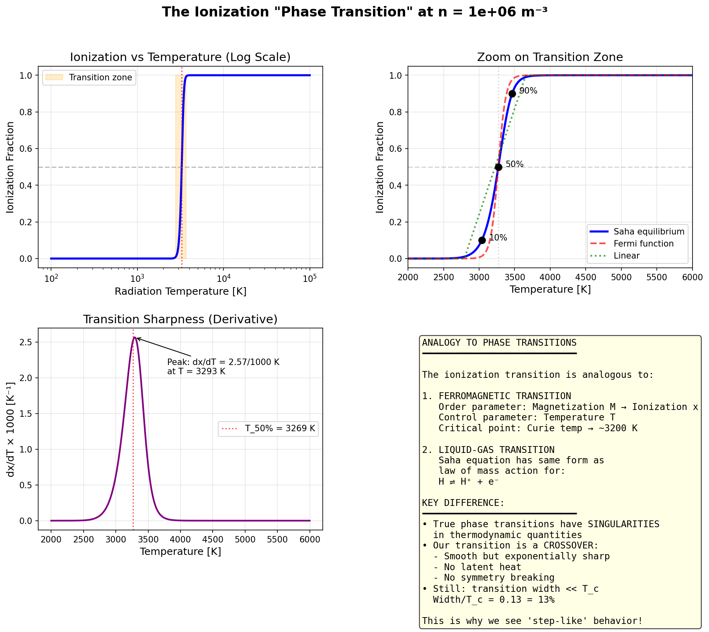

# 🌌 Gas Cloud Physics Toy Model

**A from-scratch physics simulation of a spherical hydrogen cloud bathed in blackbody radiation.**

This project models how a 1 light-year hydrogen cloud responds to different background radiation temperatures — from the cosmic microwave background (2.7 K) all the way up to stellar temperatures (100,000 K).

## 🎯 The Setup

Imagine a giant, extremely thin ball of hydrogen gas floating in vacuum:

| Parameter | Value |
|-----------|-------|
| Radius | 1 light year (9.46 × 10¹⁵ m) |
| Density | 10⁶ atoms/m³ |
| Total mass | ~1000 Earth masses |
| Environment | Isotropic blackbody radiation |

We then "turn the knob" on the background radiation temperature and watch what happens!

## 🔬 Physics Included

### Quantum Mechanics
- Hydrogen energy levels: $E_n = -13.6\text{ eV}/n^2$
- Electronic transitions (Lyman, Balmer series)
- 21 cm hyperfine transition
- Selection rules and Einstein coefficients
- Photoionization cross-sections

### Statistical Mechanics
- **Boltzmann distribution** for level populations
- **Saha equation** for ionization equilibrium:

$$\frac{n_{H^+} n_e}{n_H} = \frac{(2\pi m_e k_B T)^{3/2}}{h^3} \exp\left(-\frac{13.6\text{ eV}}{k_B T}\right)$$

- Partition functions

### Thermodynamics
- Photoionization heating
- Recombination cooling
- Bremsstrahlung (free-free) cooling
- Collisional excitation cooling
- Compton heating/cooling

### Optics & Radiative Transfer
- Optical depths at various wavelengths
- Doppler-broadened line profiles
- Planck function and blackbody statistics

### Fluid Dynamics
- Sound speed
- Jeans instability analysis
- Expansion timescales

## 🎉 Key Results: Sharp Phase Transitions!

The ionization transition is **incredibly sharp** — almost like a true phase transition:

| Ionization | Temperature |
|------------|-------------|
| 1% | ~2,800 K |
| 10% | ~3,040 K |
| **50%** | **~3,270 K** |
| 90% | ~3,470 K |
| 99% | ~3,660 K |

The transition from 10% to 90% ionization happens over just **~430 K** — a 14% change in temperature!

This sharpness comes from the exponential Boltzmann factor:
$$x_{ion} \propto \exp\left(-\frac{158,000\text{ K}}{T}\right)$$

## 📊 Sample Output









## 🚀 Getting Started

### Requirements

```bash
pip install numpy scipy matplotlib
```

### Run the Simulation

```bash
# Full simulation with plots
python simulation.py

# Detailed phase transition analysis
python phase_transitions.py

# Test individual modules
python constants.py
python blackbody.py
python atomic_physics.py
python equilibrium.py
python thermal.py
```

## 📁 Project Structure

```
├── constants.py        # Physical constants, H atom properties
├── blackbody.py        # Planck function, photon statistics
├── atomic_physics.py   # Energy levels, cross-sections, Einstein coefficients
├── equilibrium.py      # Saha equation, Boltzmann populations
├── thermal.py          # Heating/cooling rates, thermal equilibrium
├── simulation.py       # Main simulation, temperature sweeps, plotting
├── phase_transitions.py # Detailed analysis of transition sharpness
└── docs/               # Output figures
```

## 🔭 What We Learn

### Temperature Regimes

| T_rad | What Happens |
|-------|-------------|
| **2.7 K** (CMB) | Frozen hydrogen, visible only at 21 cm |
| **300 K** (room) | Still frozen, expands slowly |
| **~3,000 K** | **PHASE TRANSITION!** Ionization begins |
| **~4,000 K** | Nearly fully ionized, glowing in Balmer lines |
| **10,000+ K** | Full H II region physics |

### Gravitational Stability

The cloud is **gravitationally stable** at all temperatures:
- Jeans length: ~50–200 light years
- Cloud radius: 1 light year
- The cloud wants to **expand**, not collapse!

### Optical Depth

- **Lyman-α**: τ ~ 10⁷ at low T → completely opaque at line center
- **21 cm**: τ ~ 10³ → optically thick
- Both drop dramatically when ionization occurs

## 🔮 Future Extensions

- [ ] Time evolution (watch ionization fronts propagate)
- [ ] Emission spectrum calculation
- [ ] Spatial structure (non-uniform clouds)
- [ ] Molecular hydrogen (H₂)

## 📚 References

- Osterbrock & Ferland, *Astrophysics of Gaseous Nebulae and Active Galactic Nuclei*
- Rybicki & Lightman, *Radiative Processes in Astrophysics*
- Draine, *Physics of the Interstellar and Intergalactic Medium*

## 📜 License

Copyright © 2025 Matej Gomboc<br>
https://github.com/MatejGomboc/gas-cloud-physics-toy-model

This program is free software: you can redistribute it and/or modify it under the terms of the GNU General Public License as published by the Free Software Foundation, either version 3 of the License, or (at your option) any later version.

See [LICENSE](LICENSE) for details.

---

*Built with physics, numpy, and curiosity* 🔭✨
