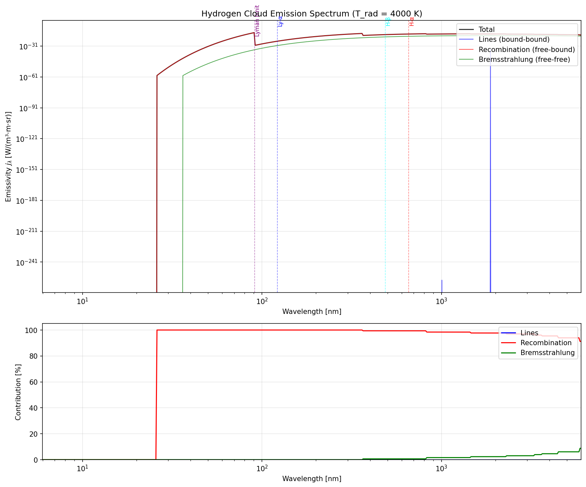
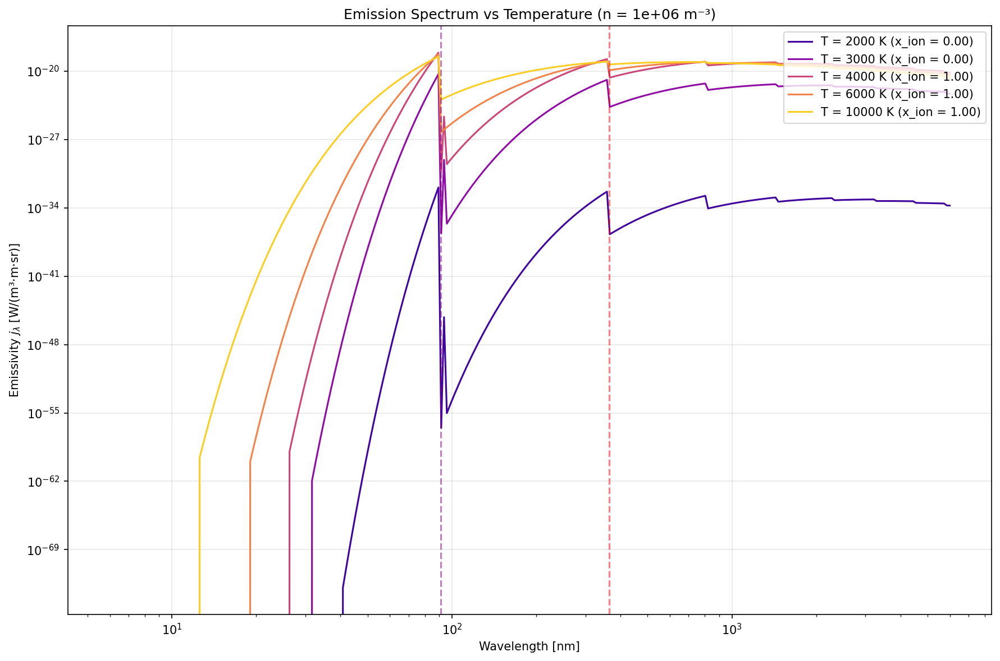
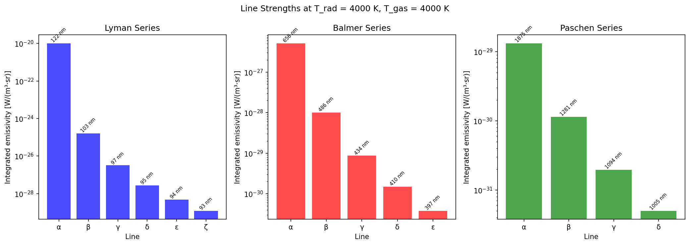

# 🌌 Gas Cloud Physics Toy Model

**A from-scratch physics simulation of a spherical hydrogen cloud bathed in blackbody radiation.**

This project models how a 1 light-year hydrogen cloud responds to different background radiation temperatures — from the cosmic microwave background (2.7 K) all the way up to stellar temperatures (100,000 K).

## 🎯 The Setup

Imagine a giant, extremely thin ball of hydrogen gas floating in a vacuum:

| Parameter | Value |
|-----------|-------|
| Radius | 1 light year (9.46 × 10¹⁵ m) |
| Density | 10⁶ atoms/m³ |
| Total mass | ~1000 Earth masses |
| Environment | Isotropic blackbody radiation |

We then "turn the knob" on the background radiation temperature and watch what happens!

## 🔬 Physics Included

### Quantum Mechanics
- Hydrogen energy levels: $E_n = -13.6\text{ eV}/n^2$
- Electronic transitions (Lyman, Balmer series)
- 21 cm hyperfine transition
- Selection rules and Einstein coefficients
- Photoionisation cross-sections

### Statistical Mechanics
- **Boltzmann distribution** for level populations
- **Saha equation** for ionization equilibrium:

$$\frac{n_{H^+} n_e}{n_H} = \frac{(2\pi m_e k_B T)^{3/2}}{h^3} \exp\left(-\frac{13.6\text{ eV}}{k_B T}\right)$$

- Partition functions

### Thermodynamics
- Photoionisation heating
- Recombination cooling
- Bremsstrahlung (free-free) cooling
- Collisional excitation cooling
- Compton heating/cooling

### Optics & Radiative Transfer
- Optical depths at various wavelengths
- Doppler-broadened line profiles
- Planck function and blackbody statistics
- **Emission spectrum calculation** (line + continuum)
- **Time-dependent radiative transfer** for ionization fronts

### Fluid Dynamics
- Sound speed
- Jeans instability analysis
- Expansion timescales

## 🎉 Key Results: Sharp Phase Transitions!

The ionisation transition is **incredibly sharp** — almost like a true phase transition:

| Ionization | Temperature |
|------------|-------------|
| 1% | ~2,800 K |
| 10% | ~3,040 K |
| **50%** | **~3,270 K** |
| 90% | ~3,470 K |
| 99% | ~3,660 K |

The transition from 10% to 90% ionisation happens over just **~430 K** — a 14% change in temperature!

This sharpness comes from the exponential Boltzmann factor:
$$x_{ion} \propto \exp\left(-\frac{158,000\text{ K}}{T}\right)$$

## 📊 Sample Output








## 🚀 Getting Started

### Requirements

```bash
pip install numpy scipy matplotlib
```

### Run the Simulation

```bash
# Full simulation with plots
python simulation.py

# Detailed phase transition analysis
python phase_transitions.py

# Emission spectrum calculation
python emission.py

# Time evolution of ionization fronts
python time_evolution.py

# Wobbling temperature / breathing simulation
python breathing.py

# Publication-quality visualizations
python visualizations.py

# Test individual modules
python constants.py
python blackbody.py
python atomic_physics.py
python equilibrium.py
python thermal.py
```

## 📁 Project Structure

```
├── constants.py        # Physical constants, H atom properties
├── blackbody.py        # Planck function, photon statistics
├── atomic_physics.py   # Energy levels, cross-sections, Einstein coefficients
├── equilibrium.py      # Saha equation, Boltzmann populations
├── thermal.py          # Heating/cooling rates, thermal equilibrium
├── emission.py         # Emission spectrum (lines + continuum)
├── time_evolution.py   # 1D spherical ionization front propagation
├── breathing.py        # Time-varying radiation field response
├── visualizations.py   # Publication-quality plots with dark theme
├── simulation.py       # Main simulation, temperature sweeps, plotting
└── phase_transitions.py # Detailed analysis of transition sharpness
```

## 💡 Emission Spectrum Module

The `emission.py` module calculates the cloud's emission spectrum from three physical processes:

### 1. Line Emission (Bound-Bound)
Spontaneous emission from excited atoms:
$$j_\nu = \frac{h\nu}{4\pi} n_u A_{ul} \phi(\nu)$$

Includes Lyman series (n→1), Balmer series (n→2), Paschen series (n→3), etc.

### 2. Recombination Continuum (Free-Bound)
Electron capture producing continuum radiation:
$$j_\nu^{fb} \propto n_e n_{H^+} \sigma_{bf}(\nu) e^{-h(\nu-\nu_n)/kT}$$

Shows characteristic "edges" at each series limit (Lyman limit at 91.2 nm, Balmer limit at 364.6 nm).

### 3. Bremsstrahlung (Free-Free)
Thermal emission from electron-ion scattering:
$$j_\nu^{ff} \propto n_e n_{H^+} T^{-1/2} g_{ff} e^{-h\nu/kT}$$

Dominates at long wavelengths in ionised plasma.

### Usage

```python
from emission import compute_emission_spectrum, plot_emission_spectrum

n_total = 1e6  # atoms/m³
T_rad = 5000   # K

spectrum = compute_emission_spectrum(n_total, T_rad)
plot_emission_spectrum(spectrum, T_rad, save_path='my_spectrum.png')
```

## ⏱️ Time Evolution Module

The `time_evolution.py` module implements **1D spherical radiative transfer** with time-dependent ionization dynamics, allowing you to watch ionization fronts propagate through the cloud.

### Physics

Unlike the equilibrium calculations (Saha equation), this module solves the **rate equations**:

$$\frac{dx}{dt} = \Gamma(\tau) \cdot (1-x) - \alpha(T) \cdot n \cdot x^2$$

Where:
- $\Gamma(\tau)$ is the photoionization rate attenuated by optical depth
- $\alpha(T)$ is the Case B recombination coefficient
- $x$ is the local ionization fraction

The optical depth is computed self-consistently as the front propagates:
$$\tau(r) = \int_r^R n_H(r') \sigma_{bf} dr'$$

### Key Features

- **Radial discretization**: Cloud divided into N shells
- **Radiative transfer**: Ionizing radiation attenuated by neutral hydrogen
- **Adaptive integration**: Uses `scipy.integrate.solve_ivp` with LSODA
- **Front tracking**: Automatically locates the ionization front position
- **Visualization**: Space-time diagrams, front velocity, multi-temperature comparisons

### Usage

```python
from time_evolution import evolve_ionization, plot_ionization_evolution
from constants import ly_to_m

# Evolve a cloud exposed to hot radiation
result = evolve_ionization(
    n_total=1e6,           # atoms/m³
    T_rad=30000,           # K (radiation temperature)
    T_gas=10000,           # K (gas kinetic temperature)
    R_cloud=1.0 * ly_to_m, # 1 light-year
    N_shells=100
)

# Visualize the propagation
plot_ionization_evolution(result, save_path='ionization_front.png')
```

### Compare Different Temperatures

```python
from time_evolution import plot_multi_temperature

plot_multi_temperature(
    temperatures=[10000, 20000, 30000, 50000],
    save_path='front_comparison.png'
)
```

## 🫁 Breathing Module

The `breathing.py` module simulates how a cloud responds to **oscillating radiation temperature** — watch ionization "breathe" in and out!

### Key Physics Insight

To see actual breathing, you need:
1. **High density** (n ~ 10¹⁰ m⁻³) for fast recombination (t_rec ~ 10 years)
2. **Truly cold** "off" temperatures (< 1000 K) where ionization is negligible
3. **Period comparable to t_rec** so the cloud can respond

At low densities (n ~ 10⁶ m⁻³), t_rec ~ 100,000 years and the cloud stays ionized through any realistic temperature oscillation!

### Scenarios

| Pattern | Behavior |
|---------|----------|
| Slow sine wave | Cloud follows temperature smoothly |
| Fast sine wave | Cloud averages out, can't follow |
| Square wave | Sharp ionize/recombine cycles |
| Short hot pulses | Sawtooth pattern, gradual buildup |

### Usage

```python
from breathing import evolve_0d, make_square_temperature
from thermal import recombination_coefficient_B

n_total = 1e10  # High density for fast response
T_gas = 8000

# Create a pulsed temperature pattern
alpha = recombination_coefficient_B(T_gas)
t_rec = 1.0 / (alpha * n_total)  # ~10 years

T_func = make_square_temperature(
    T_hot=30000, T_cold=100,
    period=5*t_rec, duty_cycle=0.5
)

t = np.linspace(0, 6*5*t_rec, 2000)
x = evolve_0d(n_total, T_func, T_gas, t)
```

## 🔭 What We Learn

### Temperature Regimes

| T_rad | What Happens |
|-------|-------------|
| **2.7 K** (CMB) | Frozen hydrogen, visible only at 21 cm |
| **300 K** (room) | Still frozen, expands slowly |
| **~3,000 K** | **PHASE TRANSITION!** Ionization begins |
| **~4,000 K** | Nearly fully ionised, glowing in Balmer lines |
| **10,000+ K** | Full H II region physics |

### Gravitational Stability

The cloud is **gravitationally stable** at all temperatures:
- Jeans length: ~50–200 light years
- Cloud radius: 1 light year
- The cloud wants to **expand**, not collapse!

### Optical Depth

- **Lyman-α**: τ ~ 10⁷ at low T → completely opaque at line center
- **21 cm**: τ ~ 10³ → optically thick
- Both drop dramatically when ionisation occurs

## 📚 References

- Osterbrock & Ferland, *Astrophysics of Gaseous Nebulae and Active Galactic Nuclei*
- Rybicki & Lightman, *Radiative Processes in Astrophysics*
- Draine, *Physics of the Interstellar and Intergalactic Medium*

## 📜 License

Copyright © 2025 Matej Gomboc<br>
https://github.com/MatejGomboc/gas-cloud-physics-toy-model

This program is free software: you can redistribute it and/or modify it under the terms of the GNU General Public License as published by the Free Software Foundation, either version 3 of the License, or (at your option) any later version.

See [LICENSE](LICENSE) for details.

---

*Built with physics, numpy, and curiosity* 🔭✨
